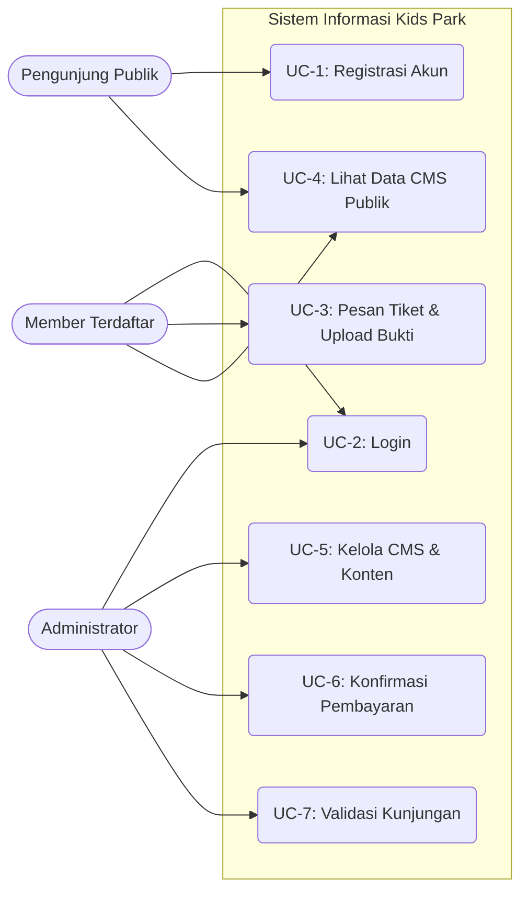
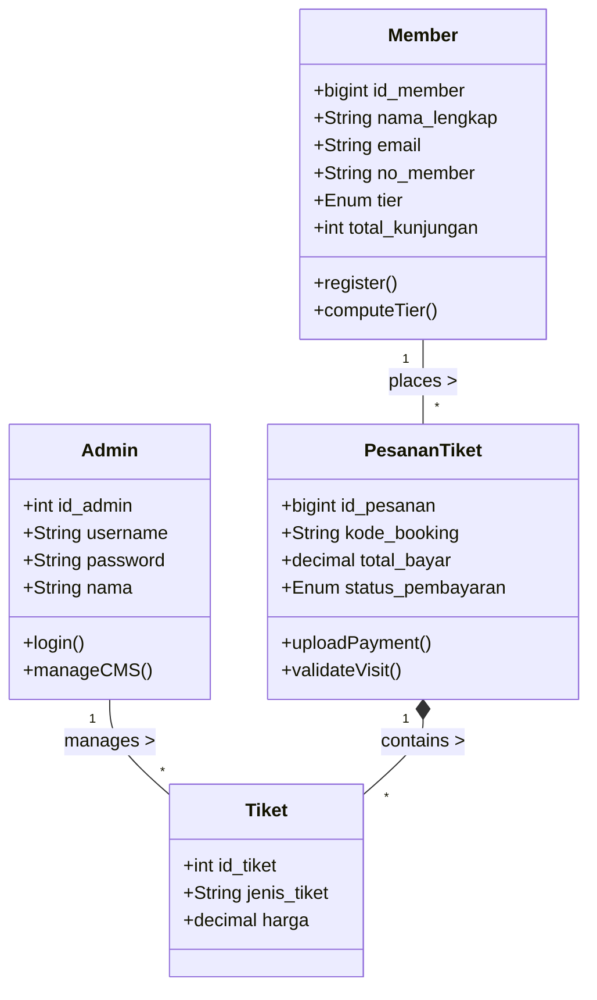
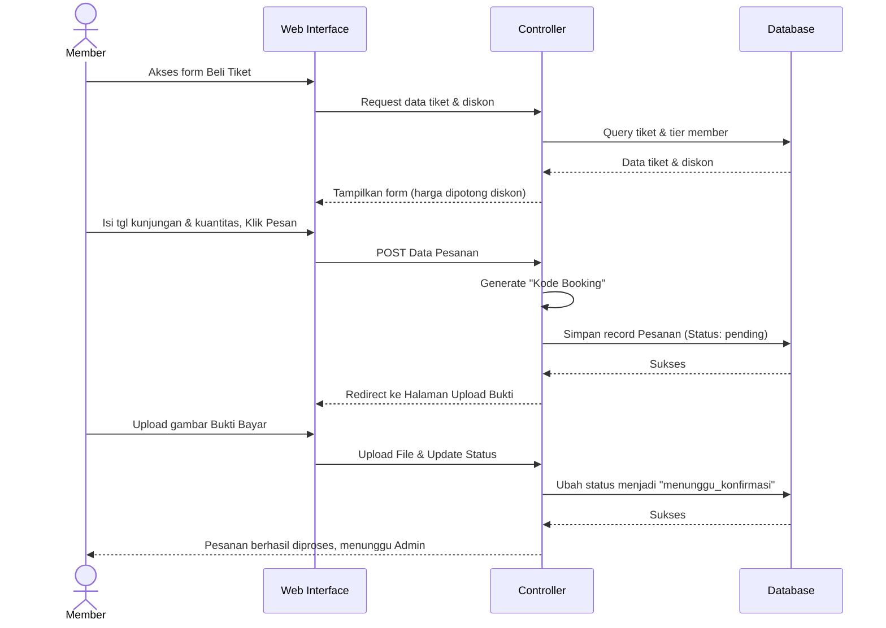

# Spesifikasi Kebutuhan Perangkat Lunak (SKPL)
**Sistem Informasi Promosi dan Layanan Kids Park**

---

## 1. Pendahuluan

### 1.1 Tujuan Penulisan Dokumen
Dokumen Spesifikasi Kebutuhan Perangkat Lunak (SKPL) ini bertujuan untuk mendefinisikan seluruh spesifikasi kebutuhan fungsional dan non-fungsional dari **Sistem Informasi Promosi dan Layanan Kids Park**. Dokumen ini dirancang untuk mendokumentasikan migrasi sistem ke framework Laravel 11, serta pengembangan fitur pemesanan tiket daring (*online booking*) dan sistem keanggotaan (*membership*) dengan sistem *tier*.

### 1.2 Lingkup Masalah
Sistem Informasi Kids Park merupakan aplikasi berbasis web yang berfungsi sebagai platform manajemen promosi, informasi layanan, dan penjualan tiket. Aplikasi ini melingkupi:
- Halaman publik untuk informasi layanan wisata.
- Sistem keanggotaan (Member) yang memberikan insentif diskon berbasis *tier*.
- Pemesanan tiket secara daring beserta mekanisme unggah bukti pembayaran.
- Panel Administrasi (Admin) untuk mengelola data *master* situs, mengonfirmasi pesanan tiket, dan memvalidasi kehadiran pengunjung.

### 1.3 Definisi, Istilah dan Singkatan
* **SKPL**: Spesifikasi Kebutuhan Perangkat Lunak.
* **Admin**: Pengelola sistem yang memiliki hak akses penuh ke *backend/dashboard*.
* **Member**: Pelanggan/pengunjung yang telah meregistrasi akun pada sistem dan memperoleh *tier*.
* **Pengunjung Publik**: Calon pengunjung wisata yang tidak login ke sistem.
* **Tier**: Tingkatan status keanggotaan member (Bronze, Silver, Gold, Platinum).
* **CMS**: *Content Management System*.
* **DBMS**: *Database Management System* (MySQL/MariaDB).

### 1.4 Aturan Penomoran
Penomoran pada dokumen ini dan elemen sistem mengikuti standar berikut:
* **F-XX** : Aturan penomoran untuk Kebutuhan Fungsional (contoh: F-01, F-02).
* **NF-XX** : Aturan penomoran untuk Kebutuhan Non-Fungsional (contoh: NF-01).
* **UC-XX** : Aturan penomoran untuk Diagram Use Case.
* **KP-M-XXXX** : Aturan penomoran ID/Nomor Member (contoh: KP-M-00001).
* **KP-YYYYMMDD-XXXX** : Aturan penomoran Kode Booking Pemesanan (contoh: KP-20260528-59XZ).

### 1.5 Referensi
* Dokumen *Business Requirements Document* (BRD) Kids Park v2.0
* Dokumen *Software Requirements Document* (SRD) Kids Park v2.0
* Dokumentasi resmi Laravel Framework 11.x

### 1.6 Deskripsi umum Dokumen (Ikhtisar)
Dokumen ini disusun ke dalam 4 bagian utama:
1. **Pendahuluan**, memberikan gambaran umum, tujuan, dan lingkup sistem.
2. **Deskripsi Umum Perangkat Lunak**, menjelaskan sistem secara makro, batasan, dan lingkungan operasi.
3. **Deskripsi Kebutuhan**, menjabarkan secara rinci kebutuhan sistem mencakup UI, fungsionalitas, non-fungsional, hingga pemodelan analisis sistem (Use Case, Kelas, Sequence).
4. **Kerunutan (*Traceability*)**, menunjukkan pemetaan silang antara fungsionalitas sistem dan model analisis.

---

## 2. Deskripsi Umum Perangkat Lunak

### 2.1 Deskripsi Umum Sistem
Sistem ini merupakan aplikasi mandiri berbasis web (*web-based application*) yang berfungsi sebagai titik interaksi terpusat antara pihak pengelola Kids Park (Admin) dengan publik/pelanggan (Member). Sistem dirancang menggunakan arsitektur MVC (*Model-View-Controller*) untuk mengotomatisasi pencatatan pemesanan tiket, validasi kunjungan wisata, serta manajemen promosi secara digital.

### 2.2 Karakteristik Pengguna
1. **Admin**: Pengguna internal yang bertugas melakukan verifikasi pembayaran dari pelanggan, memindai tiket pengunjung, dan memutakhirkan data konten situs.
2. **Member**: Pengunjung terdaftar yang dapat memesan tiket masuk dari rumah, memantau *progress tier*, dan mendapatkan harga spesial (diskon otomatis).
3. **Pengunjung Publik**: Calon pelanggan yang datang ke website hanya untuk melihat harga, layanan, galeri, dan promo terbaru tanpa harus login.

### 2.3 Batasan
* Sistem ini murni berbasis web (bukan *native mobile app*).
* Pembayaran transaksi belum terintegrasi *Payment Gateway* pihak ketiga, melainkan pelanggan harus mentransfer dana secara manual ke rekening pengelola dan mengunggah struk/bukti bayarnya.

### 2.4 Lingkungan Operasi
* **OS Server**: Windows (via Laragon) / Linux.
* **Web Server**: Apache / Nginx.
* **Platform/Bahasa**: PHP 8.3+ menggunakan framework Laravel 11.
* **Database**: MySQL 5.7+ atau MariaDB 10+.
* **Klien/Browser**: Google Chrome, Mozilla Firefox, Safari, Microsoft Edge.

---

## 3. Deskripsi Kebutuhan

### 3.1 Kebutuhan Antarmuka Eksternal

#### 3.1.1 Antarmuka pemakai
Antarmuka pengguna (UI) dibangun menggunakan HTML5, CSS3 murni (*Vanilla CSS*), dan ES6 JavaScript. Menggunakan pendekatan desain yang modern, *single-page navigation* untuk bagian publik, *Dashboard* panel untuk Admin dan Member, serta layout yang sepenuhnya responsif.

#### 3.1.2 Antarmuka Perangkat Keras
Tidak ada kebutuhan perangkat keras keras khusus di sisi klien. Pengguna dapat mengakses sistem menggunakan Perangkat PC, Laptop, maupun *Smartphone*. 

#### 3.1.3 Antarmuka Perangkat Lunak
Sistem membutuhkan *web browser* di sisi pengguna. Di sisi server, wajib menginstal PHP, sistem *routing* web server (mod_rewrite), dan koneksi *database* relasional.

#### 3.1.4 Antarmuka Komunikasi
Sistem diakses melalui jaringan intranet/internet. Seluruh transaksi protokol aplikasi terjadi melalui standar protokol komunikasi HTTP/HTTPS (Port 80/443).

### 3.2 Kebutuhan Fungsional
Berikut adalah kebutuhan fungsional (F) utama yang dapat dilakukan oleh sistem:
* **F-01**: Sistem harus menyediakan fitur Autentikasi ganda (*Dual Guard*) untuk Admin dan Member (Login, Logout, Registrasi).
* **F-02**: Sistem memungkinkan Admin mengelola (*CRUD*) data Layanan, Harga Tiket, Promosi, Galeri, dan Kontak.
* **F-03**: Sistem memungkinkan Member untuk memesan tiket, memilih tanggal kedatangan, dan mengunggah gambar bukti bayar.
* **F-04**: Sistem menghitung nominal pembayaran dikurangi diskon *Tier* Member (Bronze 0%, Silver 5%, Gold 10%, Platinum 15%) secara dinamis.
* **F-05**: Sistem memfasilitasi Admin untuk memverifikasi/mengubah status pesanan tiket (Pending → Lunas/Batal).
* **F-06**: Sistem memungkinkan Admin mencari Kode Booking dan memvalidasi kehadiran saat pelanggan datang (Status Kunjungan → Sudah Hadir).

### 3.3 Kebutuhan Non Fungsional
* **NF-01 (Ketersediaan)**: Aplikasi web harus bisa berjalan setiap hari tanpa henti kecuali saat pemeliharaan server.
* **NF-02 (Keamanan)**: Sandi (*password*) pengguna wajib dilindungi dengan *hashing Bcrypt*, dan formulir wajib memiliki validasi *CSRF Token*.
* **NF-03 (Performa & Aksesibilitas)**: *Load time* web diusahakan di bawah 3 detik, dan layout harus beradaptasi jika dibuka di layar HP.

### 3.4 Model Analisis

#### 3.4.1 Diagram Use Case

#### 3.4.1.1 Definisi Actor
1. **Publik**: Individu yang dapat melihat isi *website* tanpa perlu otentikasi.
2. **Member**: Individu yang memiliki akun terdaftar pada sistem Kids Park.
3. **Admin**: Staf pengelola operasional Kids Park.

#### 3.4.1.2 Definisi Use Case 1 (Registrasi & Login)
* **Actor**: Publik, Member, Admin
* **Skenario**: Publik memasukkan nama, email, password untuk mendaftar (*Registrasi*). Setelah terdaftar dan aktif, pengguna dapat melakukan *Login* (masuk ke Dashboard).

#### 3.4.1.3 Definisi Use Case 2 (Pemesanan Tiket)
* **Actor**: Member
* **Skenario**: Member memilih jenis tiket, mengisi jumlahnya, dan menentukan tanggal wisata. Sistem membuatkan tagihan. Member mentransfer lalu mengunggah bukti bayar.

#### 3.4.1.4 Definisi Use Case 3 (Manajemen & Validasi Admin)
* **Actor**: Admin
* **Skenario**: Admin memperbarui informasi di *website* (CMS). Admin melihat daftar pesanan masuk, mengecek gambar transfer, dan menyetujui transaksi (Lunas). Saat member datang, Admin mengecek kode booking.

#### 3.4.2 Diagram Kelas
Diagram kelas (atau representasi struktural basis data) memetakan objek yang berada di dalam sistem:

#### 3.4.2.1 Kelas Admin
Mewakili entitas Administrator sistem. Menyimpan kredensial `username` dan fungsi `manageCMS()` untuk mengubah data-data tabel statis.

#### 3.4.2.2 Kelas Member
Mewakili profil pelanggan loyal. Kelas ini menampung algoritma perhitungan tier `computeTier()` berdasarkan parameter `total_kunjungan`.

#### 3.4.2.3 Kelas PesananTiket
Mewakili entitas transaksi finansial. Memiliki properti `kode_booking` dan mekanisme upload dokumen transaksi `uploadPayment()`.

#### 3.4.3 Diagram Sequence
Berikut adalah Diagram Sequence untuk proses **Pemesanan Tiket oleh Member**:

---

## 4. Kerunutan (traceability)

### 4.1 Kebutuhan Fungsional vs Use Case

| ID Kebutuhan Fungsional | Deskripsi | ID Use Case |
|---|---|---|
| F-01 | Autentikasi Pengguna (Login/Reg) | UC-1, UC-2 |
| F-02 | Manajemen Master CMS | UC-5 |
| F-03, F-04 | Proses Beli Tiket & Hitung Diskon Tier | UC-3 |
| F-05 | Verifikasi Bukti Pembayaran oleh Admin | UC-6 |
| F-06 | Validasi Scan Kunjungan Pengunjung | UC-7 |

### 4.2 Kebutuhan Fungsional vs Diagram Kelas

| ID Kebutuhan Fungsional | Kelas (Entitas) Utama yang Terlibat |
|---|---|
| F-01 | Admin, Member |
| F-02 | Admin, Tiket (beserta tabel CMS lainnya: Layanan, Promosi) |
| F-03, F-04 | Member, PesananTiket, Tiket |
| F-05, F-06 | Admin, PesananTiket |
