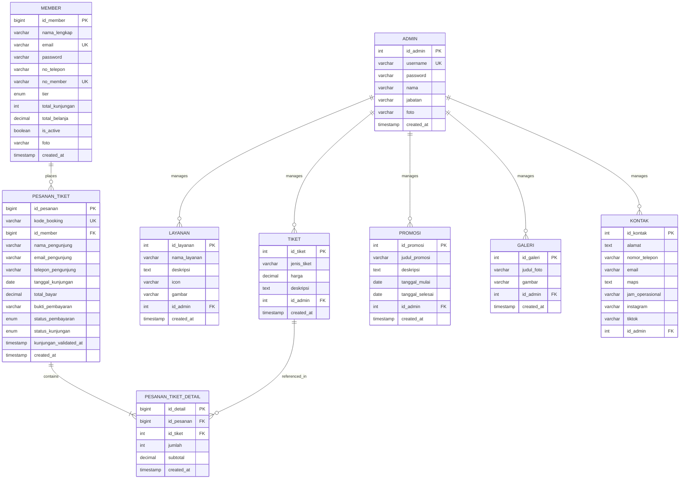

# Software Requirements Document (SRD)
**Sistem Informasi Promosi dan Layanan Kids Park**

| Atribut | Detail |
|---------|--------|
| **Kode Dokumen** | GL01-SRD-KP-2025 |
| **Versi** | 2.0 |
| **Tanggal** | Juni 2025 |
| **Status** | Final |
| **Tim** | Kelompok 9 — D4 SIKC POLINDRA |
| **Referensi** | BRD v2.0, SKPL v2.0 |

---

## 1. PENDAHULUAN

### 1.1 Tujuan Dokumen
Dokumen Software Requirements Document (SRD) ini mendefinisikan spesifikasi teknis perangkat lunak secara terperinci, mencakup arsitektur sistem, teknologi yang digunakan, desain database, spesifikasi API/routing, mekanisme keamanan, serta pedoman implementasi untuk **Sistem Informasi Promosi dan Layanan Kids Park**.

### 1.2 Lingkup Sistem
Sistem ini merupakan aplikasi web full-stack berbasis **Laravel 13** yang terdiri dari tiga modul utama:
1. **Modul Publik** — Halaman informasi (landing page) yang dapat diakses tanpa autentikasi.
2. **Modul Member** — Area khusus pelanggan terdaftar untuk pemesanan tiket dan manajemen akun.
3. **Modul Admin** — Panel pengelolaan konten, pesanan, dan member.

### 1.3 Definisi & Akronim

| Istilah | Definisi |
|---------|----------|
| MVC | Model-View-Controller, pola arsitektur Laravel |
| Blade | Template engine bawaan Laravel |
| Vite | Build tool untuk bundling CSS/JS |
| Eloquent ORM | Object-Relational Mapping milik Laravel |
| Middleware | Lapisan filter request sebelum mencapai controller |
| Guard | Mekanisme autentikasi Laravel untuk multi-auth |
| Migration | Version control untuk skema database |
| Seeder | Script pengisian data awal database |

---

## 2. ARSITEKTUR SISTEM

### 2.1 Diagram Arsitektur Tingkat Tinggi

```
┌─────────────────────────────────────────────────────────┐
│                      CLIENT LAYER                        │
│  ┌──────────┐  ┌──────────┐  ┌──────────────────────┐   │
│  │ Browser  │  │ Mobile   │  │ Admin Browser        │   │
│  │ (Publik) │  │ Browser  │  │ (Desktop)            │   │
│  └────┬─────┘  └────┬─────┘  └──────────┬───────────┘   │
└───────┼──────────────┼──────────────────┼────────────────┘
        │              │                  │
        ▼              ▼                  ▼
┌─────────────────────────────────────────────────────────┐
│                   WEB SERVER (Apache)                     │
│                   PHP 8.3+ / Laravel 13                   │
├─────────────────────────────────────────────────────────┤
│  ┌──────────┐  ┌──────────────┐  ┌────────────────┐    │
│  │  Routes  │→ │  Middleware   │→ │  Controllers   │    │
│  │ (web.php)│  │ (Auth Guard)  │  │ (Business Logic│    │
│  └──────────┘  └──────────────┘  └───────┬────────┘    │
│                                          │              │
│  ┌──────────┐  ┌──────────────┐  ┌───────▼────────┐    │
│  │  Views   │← │   Helpers    │  │    Models       │    │
│  │ (Blade)  │  │ (AppHelper)  │  │  (Eloquent ORM) │    │
│  └──────────┘  └──────────────┘  └───────┬────────┘    │
└──────────────────────────────────────────┼──────────────┘
                                           │
                                           ▼
┌─────────────────────────────────────────────────────────┐
│                   DATABASE LAYER                         │
│                MySQL 5.7+ / MariaDB 10+                  │
│                Database: kidspark_db                     │
│  ┌────────┐ ┌────────┐ ┌────────┐ ┌─────────────────┐  │
│  │ admin  │ │layanan │ │ tiket  │ │ pesanan_tiket   │  │
│  │ galeri │ │promosi │ │ kontak │ │ pesanan_detail  │  │
│  │members │ │ users  │ │ cache  │ │ jobs, sessions  │  │
│  └────────┘ └────────┘ └────────┘ └─────────────────┘  │
└─────────────────────────────────────────────────────────┘
```

### 2.2 Technology Stack

| Layer | Teknologi | Versi |
|-------|-----------|-------|
| **Language** | PHP | 8.3+ |
| **Framework** | Laravel | 13.x |
| **Template Engine** | Blade | (bawaan Laravel) |
| **Build Tool** | Vite | 6.x |
| **Database** | MySQL / MariaDB | 5.7+ / 10+ |
| **ORM** | Eloquent | (bawaan Laravel) |
| **Web Server** | Apache (Laragon) | 2.4+ |
| **CSS** | Vanilla CSS + CSS Variables | — |
| **JavaScript** | Vanilla JS | ES6+ |
| **Package Manager** | Composer (PHP), npm (JS) | 2.x, 10+ |
| **Password Hashing** | Bcrypt | 12 rounds |

---

## 3. STRUKTUR DIREKTORI

```
kidspark/
├── app/
│   ├── Helpers/
│   │   └── AppHelper.php              # formatRupiah()
│   ├── Http/
│   │   ├── Controllers/
│   │   │   ├── Admin/
│   │   │   │   ├── AuthController.php         # Login/logout admin
│   │   │   │   ├── DashboardController.php    # Statistik dashboard
│   │   │   │   ├── LayananController.php      # CRUD layanan
│   │   │   │   ├── TiketController.php        # CRUD tiket
│   │   │   │   ├── PromosiController.php      # CRUD promosi
│   │   │   │   ├── GaleriController.php       # Upload/hapus galeri
│   │   │   │   ├── KontakController.php       # Edit kontak
│   │   │   │   ├── ProfilController.php       # Edit profil admin
│   │   │   │   ├── PesananController.php      # Kelola pesanan tiket
│   │   │   │   └── MemberController.php       # Kelola member
│   │   │   ├── PublicController.php           # Halaman publik
│   │   │   ├── PublicTicketController.php     # Pemesanan tiket publik
│   │   │   ├── MemberAuthController.php       # Auth member
│   │   │   └── MemberDashboardController.php  # Dashboard member
│   │   └── Middleware/
│   │       ├── AdminAuth.php                  # Guard admin
│   │       └── MemberAuth.php                 # Guard member
│   └── Models/
│       ├── Admin.php
│       ├── Member.php          # Tier system, diskon, progress
│       ├── Layanan.php
│       ├── Tiket.php
│       ├── Promosi.php
│       ├── Galeri.php
│       ├── Kontak.php
│       ├── PesananTiket.php
│       └── PesananTiketDetail.php
│
├── resources/views/
│   ├── welcome.blade.php              # Landing page publik
│   ├── layouts/
│   │   ├── app.blade.php             # Layout publik/member
│   │   └── admin.blade.php           # Layout admin panel
│   ├── admin/
│   │   ├── login.blade.php
│   │   ├── dashboard.blade.php
│   │   ├── layanan/  tiket/  promosi/  galeri/  kontak/  profil/
│   │   ├── pesanan/ (index, show, validasi)
│   │   └── member/ (index, show, create, edit)
│   ├── member/
│   │   ├── login.blade.php  register.blade.php
│   │   ├── dashboard.blade.php
│   │   ├── riwayat.blade.php
│   │   └── profil.blade.php
│   └── tiket/
│       ├── beli.blade.php    bayar.blade.php
│       ├── status.blade.php  cari.blade.php
│
├── routes/web.php                     # Seluruh route definisi
├── database/migrations/               # Skema tabel
├── public/assets/                     # Aset statis (gambar, uploads)
└── config/                            # Konfigurasi Laravel
```

---

## 4. DESAIN DATABASE

### 4.1 Entity Relationship Diagram (ERD)



### 4.2 Detail Tabel

#### Tabel `admin`
| Kolom | Tipe | Constraint | Keterangan |
|-------|------|-----------|------------|
| id_admin | INT | PK, AUTO_INCREMENT | ID unik admin |
| username | VARCHAR(50) | UNIQUE, NOT NULL | Username login |
| password | VARCHAR(255) | NOT NULL | Bcrypt hash |
| nama | VARCHAR(100) | NULLABLE | Nama tampilan |
| jabatan | VARCHAR(100) | NULLABLE | Jabatan/posisi |
| foto | VARCHAR(255) | NULLABLE | Path foto profil |
| created_at | TIMESTAMP | DEFAULT CURRENT_TIMESTAMP | Waktu dibuat |

#### Tabel `members`
| Kolom | Tipe | Constraint | Keterangan |
|-------|------|-----------|------------|
| id_member | BIGINT UNSIGNED | PK, AUTO_INCREMENT | ID unik member |
| nama_lengkap | VARCHAR(100) | NOT NULL | Nama lengkap |
| email | VARCHAR(100) | UNIQUE, NOT NULL | Email login |
| password | VARCHAR(255) | NOT NULL | Bcrypt hash |
| no_telepon | VARCHAR(20) | NULLABLE | Nomor telepon |
| no_member | VARCHAR(20) | UNIQUE, NOT NULL | Kode member (KP-M-XXXXX) |
| tier | ENUM('Bronze','Silver','Gold','Platinum') | DEFAULT 'Bronze' | Tingkatan |
| total_kunjungan | INT | DEFAULT 0 | Akumulasi kunjungan |
| total_belanja | DECIMAL(12,2) | DEFAULT 0.00 | Akumulasi belanja |
| is_active | TINYINT(1) | DEFAULT 1 | Status aktif |
| foto | VARCHAR(255) | NULLABLE | Path foto profil |
| created_at, updated_at | TIMESTAMP | NULLABLE | Timestamps |

#### Tabel `pesanan_tiket`
| Kolom | Tipe | Constraint | Keterangan |
|-------|------|-----------|------------|
| id_pesanan | BIGINT UNSIGNED | PK, AUTO_INCREMENT | ID pesanan |
| kode_booking | VARCHAR(20) | UNIQUE, NOT NULL | Format: KP-YYYYMMDD-XXXX |
| id_member | BIGINT UNSIGNED | FK → members.id_member, ON DELETE SET NULL | Pemesan |
| nama_pengunjung | VARCHAR(100) | NOT NULL | Nama pemesan |
| email_pengunjung | VARCHAR(100) | NOT NULL | Email pemesan |
| telepon_pengunjung | VARCHAR(20) | NOT NULL | Telepon pemesan |
| tanggal_kunjungan | DATE | NOT NULL | Tanggal rencana kunjungan |
| total_bayar | DECIMAL(10,2) | NOT NULL | Total setelah diskon |
| bukti_pembayaran | VARCHAR(255) | NULLABLE | Path file bukti bayar |
| status_pembayaran | ENUM | DEFAULT 'pending' | pending/menunggu_konfirmasi/lunas/batal |
| status_kunjungan | ENUM | DEFAULT 'belum_hadir' | belum_hadir/sudah_hadir |
| kunjungan_validated_at | TIMESTAMP | NULLABLE | Waktu validasi kehadiran |

#### Tabel `pesanan_tiket_detail`
| Kolom | Tipe | Constraint | Keterangan |
|-------|------|-----------|------------|
| id_detail | BIGINT UNSIGNED | PK, AUTO_INCREMENT | ID detail |
| id_pesanan | BIGINT UNSIGNED | FK → pesanan_tiket, ON DELETE CASCADE | Referensi pesanan |
| id_tiket | INT | FK → tiket.id_tiket, ON DELETE CASCADE | Referensi tiket |
| jumlah | INT | NOT NULL | Jumlah tiket |
| subtotal | DECIMAL(10,2) | NOT NULL | Harga × jumlah |

---

## 5. SPESIFIKASI ROUTING

### 5.1 Route Publik

| Method | URI | Controller | Nama Route | Deskripsi |
|--------|-----|-----------|------------|-----------|
| GET | `/` | PublicController@index | home | Landing page |
| GET | `/tiket/beli` | PublicTicketController@beli | tiket.beli | Form beli tiket |
| POST | `/tiket/beli` | PublicTicketController@store | tiket.store | Proses pemesanan |
| GET | `/tiket/bayar/{kode}` | PublicTicketController@bayar | tiket.bayar | Halaman pembayaran |
| POST | `/tiket/bayar/{kode}` | PublicTicketController@uploadBukti | tiket.upload_bukti | Upload bukti bayar |
| GET | `/tiket/status/{kode}` | PublicTicketController@status | tiket.status | Status pesanan |
| GET | `/tiket/cari` | PublicTicketController@cari | tiket.cari | Cari kode booking |

### 5.2 Route Member (`/member/*`)

| Method | URI | Controller | Middleware | Deskripsi |
|--------|-----|-----------|-----------|-----------|
| GET/POST | `/member/login` | MemberAuthController | — | Login member |
| GET/POST | `/member/register` | MemberAuthController | — | Registrasi member |
| POST | `/member/logout` | MemberAuthController | — | Logout |
| GET | `/member/dashboard` | MemberDashboardController | member.auth | Dashboard |
| GET | `/member/riwayat` | MemberDashboardController | member.auth | Riwayat pesanan |
| GET/PUT | `/member/profil` | MemberDashboardController | member.auth | Edit profil |
| PUT | `/member/profil/password` | MemberDashboardController | member.auth | Ganti password |

### 5.3 Route Admin (`/admin/*`)

| Method | URI | Controller | Deskripsi |
|--------|-----|-----------|-----------|
| GET/POST | `/admin/login` | AuthController | Login admin |
| POST | `/admin/logout` | AuthController | Logout |
| GET | `/admin/dashboard` | DashboardController | Dashboard statistik |
| GET/POST | `/admin/layanan` | LayananController | List & tambah layanan |
| GET/PUT/DELETE | `/admin/layanan/{id}` | LayananController | Edit & hapus layanan |
| GET/POST | `/admin/tiket` | TiketController | List & tambah tiket |
| GET/PUT/DELETE | `/admin/tiket/{id}` | TiketController | Edit & hapus tiket |
| GET/POST | `/admin/promosi` | PromosiController | List & tambah promosi |
| GET/PUT/DELETE | `/admin/promosi/{id}` | PromosiController | Edit & hapus promosi |
| GET/POST | `/admin/galeri` | GaleriController | List & upload galeri |
| DELETE | `/admin/galeri/{id}` | GaleriController | Hapus galeri |
| GET/PUT | `/admin/kontak` | KontakController | Lihat & edit kontak |
| GET/PUT | `/admin/profil` | ProfilController | Profil admin |
| GET | `/admin/pesanan` | PesananController | Daftar pesanan |
| GET | `/admin/pesanan/{id}` | PesananController | Detail pesanan |
| POST | `/admin/pesanan/{id}/konfirmasi` | PesananController | Konfirmasi bayar |
| POST | `/admin/pesanan/{id}/batal` | PesananController | Batalkan pesanan |
| GET/POST | `/admin/validasi` | PesananController | Validasi kunjungan |
| Resource | `/admin/member` | MemberController | CRUD member |

---

## 6. MEKANISME AUTENTIKASI

### 6.1 Multi-Guard Authentication

Sistem menggunakan **dua Laravel Auth Guard** yang terpisah:

```
┌─────────────────────────────────────────────────┐
│              Authentication Guards               │
├──────────────────────┬──────────────────────────┤
│    Guard: admin      │    Guard: member          │
├──────────────────────┼──────────────────────────┤
│ Provider: admins     │ Provider: members         │
│ Model: Admin.php     │ Model: Member.php         │
│ Login: username+pass │ Login: email+password      │
│ Middleware: admin.auth│ Middleware: member.auth   │
│ Session key: admin_* │ Session key: member_*      │
│ Redirect: /admin/login│ Redirect: /member/login  │
└──────────────────────┴──────────────────────────┘
```

### 6.2 Alur Autentikasi

**Admin Login Flow:**
1. Admin mengakses `/admin/login`
2. Submit form (username + password)
3. Server verifikasi dengan `Hash::check()` terhadap bcrypt hash
4. Jika valid → `Auth::guard('admin')->login($admin)` → redirect ke `/admin/dashboard`
5. Jika invalid → tampilkan error, kembali ke form login

**Member Registration Flow:**
1. Calon member mengakses `/member/register`
2. Submit form (nama, email, telepon, password)
3. Validasi: email unik, password min 6 karakter
4. Record dibuat dengan `is_active = false`
5. Nomor member auto-generate: `KP-M-XXXXX`
6. Redirect ke login dengan pesan "menunggu konfirmasi admin"
7. Admin approve via panel → `is_active = true`
8. Member bisa login

### 6.3 Password Security
- **Algoritma:** Bcrypt
- **Rounds:** 12 (dikonfigurasi via `BCRYPT_ROUNDS=12`)
- **Laravel cast:** `'password' => 'hashed'` pada model Member

---

## 7. SISTEM MEMBERSHIP & TIER

### 7.1 Tier Definition

| Tier | Min Kunjungan | Max Kunjungan | Diskon | Warna | Ikon |
|------|:------------:|:------------:|:------:|-------|------|
| Bronze | 0 | 4 | 0% | #cd7f32 | 🥉 |
| Silver | 5 | 14 | 5% | #9e9e9e | 🥈 |
| Gold | 15 | 29 | 10% | #FFD700 | 🥇 |
| Platinum | 30 | ∞ | 15% | #4ECDC4 | 💎 |

### 7.2 Tier Progression Logic

```
Member mendaftar → Bronze (0 kunjungan)
    ↓
Admin approve → is_active = true
    ↓
Member beli tiket → PesananTiket created
    ↓
Admin konfirmasi pembayaran → status = lunas, total_belanja ↑
    ↓
Pengunjung datang → Admin validasi kunjungan
    ↓
total_kunjungan++ → computeTier() → tier di-update otomatis
    ↓
Tier naik → diskon lebih besar pada pembelian berikutnya
```

### 7.3 Diskon Calculation
```php
$diskon_persen = $member->diskon;           // 0, 5, 10, atau 15
$diskon_nominal = $total_bayar * ($diskon_persen / 100);
$total_bayar_final = $total_bayar - $diskon_nominal;
```

---

## 8. ALUR PEMESANAN TIKET

### 8.1 Flow Diagram

```
[Member Login] → [Pilih Tiket & Qty] → [Isi Data Pengunjung]
       ↓                                        ↓
[Validasi Input]                        [Generate Kode Booking]
       ↓                                   (KP-YYYYMMDD-XXXX)
[Hitung Total + Diskon Member]                  ↓
       ↓                               [Simpan ke DB]
[Redirect ke Halaman Bayar]                     ↓
       ↓                               [Upload Bukti Bayar]
[Status: menunggu_konfirmasi]                   ↓
       ↓                               [Admin Konfirmasi]
[Status: lunas] ← ─ ─ ─ ─ ─ ─ ─ ─ ─ ─┘       ↓
       ↓                               [Pengunjung Datang]
[Admin Validasi Kunjungan]                      ↓
       ↓                               [total_kunjungan++]
[Status: sudah_hadir]                   [tier di-recalculate]
```

### 8.2 Status Pembayaran State Machine

```
pending → menunggu_konfirmasi → lunas
   ↓              ↓
 batal           batal
```

---

## 9. FILE UPLOAD SPECIFICATION

| Parameter | Nilai |
|-----------|-------|
| **Tipe yang diizinkan** | JPG, JPEG, PNG, WEBP |
| **Ukuran maksimal** | 5 MB (5120 KB) |
| **Penamaan file** | `uniqid() . '_' . time() . '.' . extension` |
| **Storage disk** | `public` (Laravel Storage) |
| **Path galeri** | `storage/app/public/uploads/galeri/` |
| **Path bukti bayar** | `storage/app/public/uploads/bukti_bayar/` |
| **Path foto admin** | `storage/app/public/uploads/admin/` |
| **Akses URL** | `/storage/uploads/{folder}/{filename}` |
| **Cleanup** | File fisik dihapus bersamaan saat record DB dihapus |

---

## 10. KEBUTUHAN NON-FUNGSIONAL

### 10.1 Performa
- Halaman harus termuat dalam < 3 detik pada koneksi normal.
- Query database menggunakan Eloquent ORM dengan eager loading untuk relasi.
- Aset CSS/JS di-bundle menggunakan Vite untuk optimasi.

### 10.2 Keamanan
- [x] Password hashing dengan Bcrypt (12 rounds)
- [x] CSRF token pada setiap form (`@csrf` Blade directive)
- [x] Prepared statements via Eloquent ORM (mencegah SQL Injection)
- [x] `htmlspecialchars()` via Blade `{{ }}` (mencegah XSS)
- [x] Middleware auth terpisah untuk admin dan member
- [x] Validasi tipe dan ukuran file pada upload
- [x] Session regeneration setelah login
- [x] Session invalidation pada logout

### 10.3 Responsivitas
- Layout responsif untuk desktop (>1024px), tablet (768–1024px), dan mobile (<768px).
- Hamburger menu untuk navigasi mobile.
- CSS media queries dan flexbox/grid layout.

### 10.4 Kompatibilitas Browser
- Google Chrome 90+
- Mozilla Firefox 88+
- Safari 14+
- Microsoft Edge 90+

---

## 11. HELPER FUNCTIONS

| Fungsi | Lokasi | Deskripsi |
|--------|--------|-----------|
| `formatRupiah($angka)` | `app/Helpers/AppHelper.php` | Format angka ke `Rp XX.XXX` |
| `Member::computeTier($kunjungan)` | `app/Models/Member.php` | Hitung tier berdasarkan total kunjungan |
| `Member::generateNoMember()` | `app/Models/Member.php` | Generate nomor member `KP-M-XXXXX` |
| `$member->diskon` | Accessor pada Member model | Return diskon persen berdasarkan tier |
| `$member->tier_progress` | Accessor pada Member model | Return progress ke tier berikutnya |

---

## 12. KONFIGURASI ENVIRONMENT

### 12.1 File `.env` (Development)

| Key | Nilai | Keterangan |
|-----|-------|------------|
| APP_NAME | Kids Park | Nama aplikasi |
| APP_ENV | local | Environment |
| APP_DEBUG | true | Mode debug |
| DB_CONNECTION | mysql | Driver database |
| DB_HOST | 127.0.0.1 | Host database |
| DB_PORT | 3306 | Port MySQL |
| DB_DATABASE | kidspark_db | Nama database |
| DB_USERNAME | root | Username DB |
| DB_PASSWORD | (kosong) | Password DB |
| BCRYPT_ROUNDS | 12 | Rounds hashing |
| SESSION_DRIVER | file | Driver session |
| FILESYSTEM_DISK | local | Disk storage |

---

*Dokumen ini terakhir diperbarui: Juni 2025 | Versi 2.0*
*Program Studi D4 Sistem Informasi Kota Cerdas — Teknik Informatika — POLINDRA*
